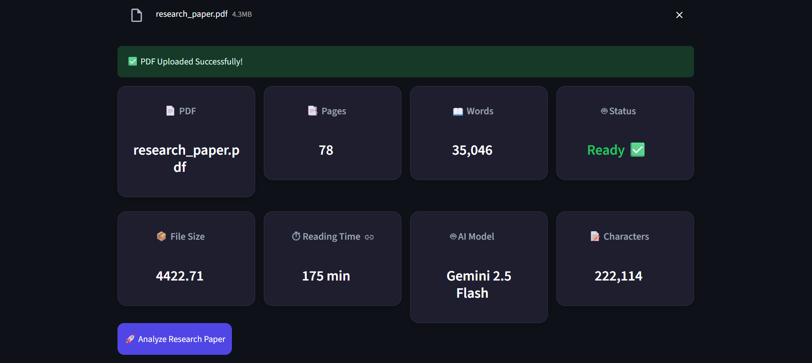
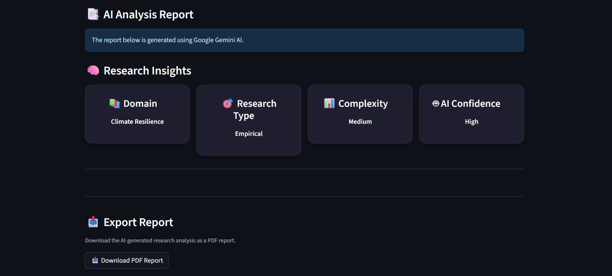
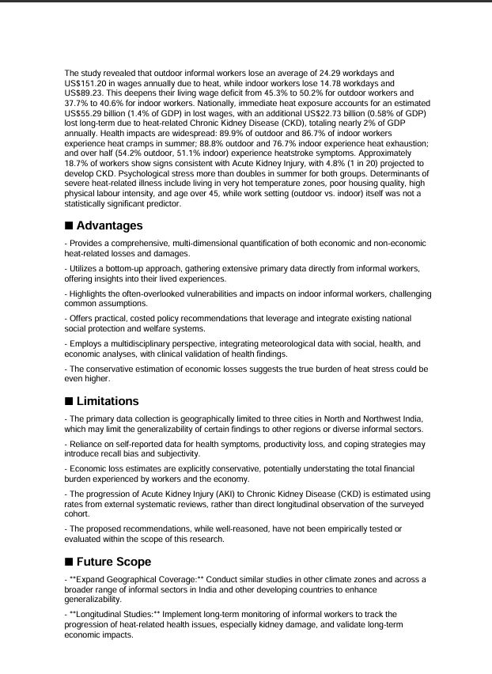
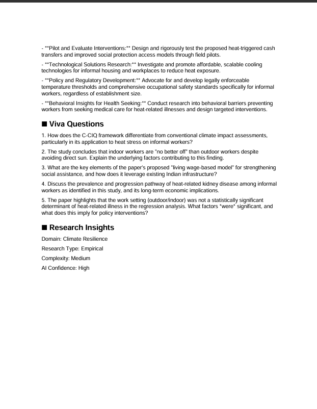
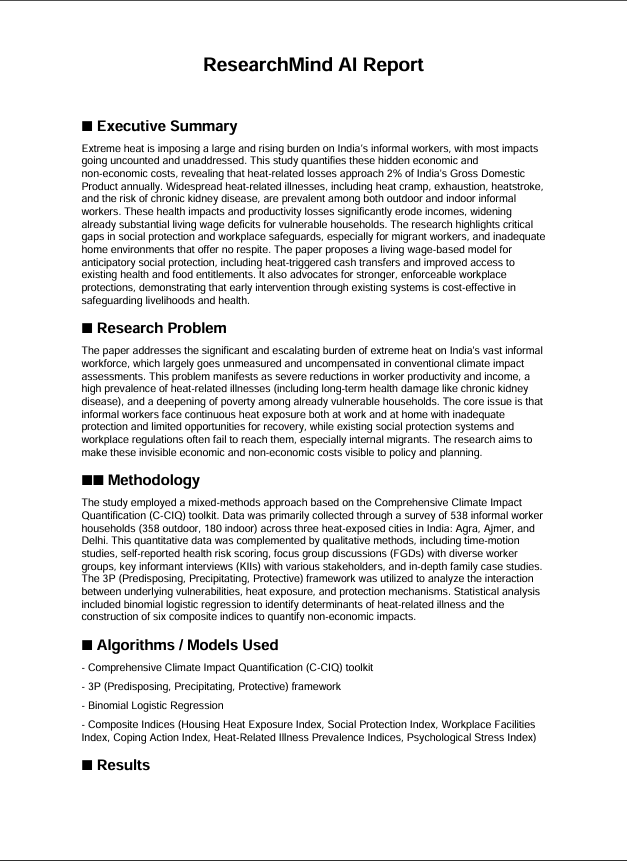

# 🧠 ResearchMind AI

> **AI-Powered Research Paper Analyzer built with Streamlit & Google Gemini**

ResearchMind AI is an intelligent web application that analyzes research papers and generates structured AI-powered reports in seconds.

It extracts important sections such as:

- 📑 Executive Summary
- 🎯 Research Problem
- ⚙️ Methodology
- 🧠 Algorithms Used
- 📊 Results
- ✅ Advantages
- ❌ Limitations
- 🚀 Future Scope
- ❓ Viva Questions

The application also generates quick research insights and allows users to export the report as a professional PDF.


## ✨ Features

- 📄 Upload Research Papers (PDF)
- 🤖 AI-Powered Analysis using Google Gemini
- 📑 Structured Research Report
- 🧠 Research Insights
- ❓ AI Generated Viva Questions
- 📥 Export Report as PDF
- 📊 Dashboard with Research Statistics
- 🎨 Clean & Interactive Streamlit UI


## 🛠 Tech Stack

| Technology    | Purpose             |
| ------------- | ------------------- |
| Python        | Backend             |
| Streamlit     | Web App             |
| Google Gemini | AI Analysis         |
| PyMuPDF       | PDF Text Extraction |
| ReportLab     | PDF Generation      |
| Python Dotenv | API Key Management  |


## ⚙ Installation

Clone the repository

```bash
git clone https://github.com/YOUR_USERNAME/ResearchMind_AI.git
```

Go to project

```bash
cd ResearchMind_AI
```

Install dependencies

```bash
pip install -r requirements.txt
```

Create a `.env` file

```text
GEMINI_API_KEY=YOUR_API_KEY
```

Run the application

```bash
streamlit run app.py
```


## 📸 Screenshots

<h3>🏠 Home Page</h3>

<p align="center">
  
</p>

<p align="center">
  
</p>

<h3>📊 Dashboard</h3>

<p align="center">
  
</p>

<p align="center">
  
</p>

<p align="center">
  
</p>

<p align="center">
  
</p>

<h3>📄 AI Report</h3>

<p align="center">
  
</p>

<p align="center">
  
</p>

<p align="center">
  
</p>

<p align="center">
  
</p>

<p align="center">
  
</p>

<p align="center">
  
</p>

<p align="center">
  
</p>

<p align="center">
  
</p>

<p align="center">
  
</p>

<p align="center">
  
</p>

<p align="center">
  
</p>


## 🔮 Version 2 Roadmap

- 💬 Chat with PDF
- 🤖 Multi-Agent Research System
- 📚 RAG Integration
- 🔍 Semantic Search
- 📖 Citation Extraction
- 📊 Compare Multiple Research Papers


## 👨‍💻 Author

**Tarun Kumawat**

B.Tech - Artificial Intelligence & Data Science

If you like this project, consider giving it a ⭐ on GitHub.

<p align="center">
  
</p>
